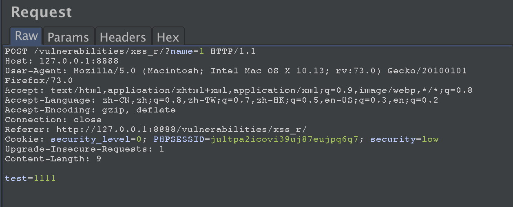
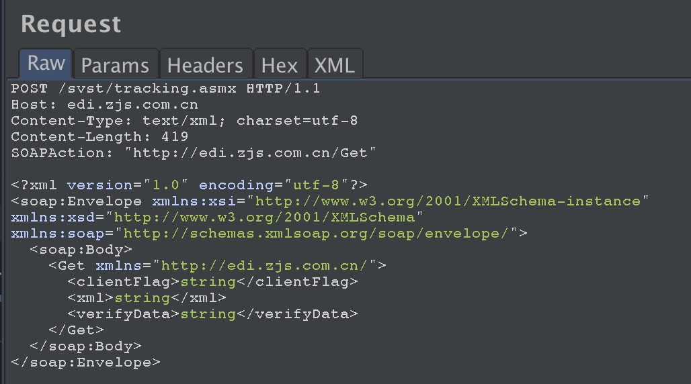
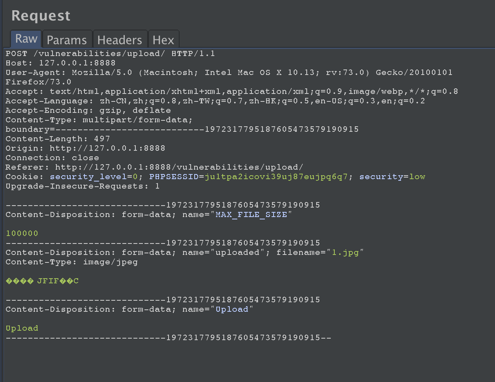
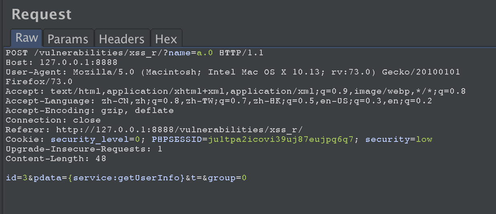

### 前记
> 每个安全从业者，都想开发自己的扫描器。这句话应该没错？

> 扫描器可以对每个参数，每个数据包都会按照你给的规则检查，可以一天25小时干活不累。


### 简介

>  被动扫描器相对于主动扫描，不主动收集流量，信息等，只接受来自其他方式获取来的流量，通过内置规则，对数据包进行增删改查，发现可能存在的漏洞风险。

> 工具如xray,w13scan等被动扫描器使用普遍，均集成poc和web常见漏洞的探测。xray商业化产品，其web漏洞探测不开源，poc开放接口供安全研究者编写，w13scan对于流量处理，规则、poc的编写也有一些值得称赞的地方。

> 本项目开发之初是为了渗透测试不遗漏一个数据包一个参数的目的下，集成自己对web安全常规漏洞检测，常见poc收集开发的思考实践。

### 开发原理


- Step1: 利用Burp获取的流量，通过Burp加载的myscan.jar插件调取burpsuite的API，把请求体和响应体格式化json数据入Redis。具体json数据结构见： [Class2-进阶用法及开发指南](Class2-进阶用法及开发指南.md)

- Step2: Myscan工程从Redis取json数据，通过对json数据转为python的字典，对请求体数据包分为三类,如下数据包:

- PerFile（每个文件）:对 http://127.0.0.1:8888/vulnerabilities/xss_r/ 进行hash
	
	- PerFolder(每个文件夹):把url拆分目录得到["http://127.0.0.1:8888/","http://127.0.0.1:8888/vulnerabilities/","http://127.0.0.1:8888/vulnerabilities/xss_r/"] （每个目录均以/结尾）,分别对三个目录进行hash
	
	- PerScheme（每个数据包）:把数据包中url，cookie，body中的参数名，post方法，http协议，host，port，urlpath:http://127.0.0.1:8888/vulnerabilities/xss_r/进行hash
	
- 针对面对一些如thinkphp 使用控制器http://test.com/index.php?c=search&args=xxxx 这种情况，myscan插件中有个右键模式，可以在burp中选中一条数据或者多条数据，右键"Send to Myscan“,此模式数据包去重根据myscan配置里的Rightclick uniq按钮去重，默认去重，当然针对如thinkphp某些数据包，你可能得把Rightclick uniq变为false。
- Step3: 把PerFile，PerFolder，PerScheme和json数据合并为一个字典序列化后传入Redis
- Step4: 工作进程从Redis获取数据反序列化后，开始调用模块进行探测，如果探测到结果，保存结果存入redis
- Step5: 保存数据线程接收到存在结果，开始输出到html文件


### 反连平台
Dnslog在渗透测试中越来越重要，特别在写poc过程中，这个当然不能少。工具支持http dnslog rmi ldap四种方式的反连方式

> 如果需要使用反连平台，你需要准备一个域名和一个公网的服务器,如域名 aaaaaaa.com ,公网ip 1.2.3.4，在域名管理处添加如下两条记录:
>
|  主机记录   | 记录类型  | 值  |
|  :----:  | :----:  | :----:  |
|  xxxxx   | A  | 1.2.3.4  |
|  testlog   | NS  | xxxxx.aaaaaaa.com  |

> 以上配置，代表testlog.aaaaaaa.com下子域名均使用xxxxx.aaaaaaa.com来解析，而xxxxx.aaaaaaa.com的地址又是1.2.3.4，所以当有人请求解析yyyy.testlog.aaaaaaa.com的地址时候，由于制定了ns服务器，会向1.2.3.4请求解析，此时运行在1.2.3.4的myscan服务监听在53端口，收到请求后记录入库，返回127.0.0.1的响应。
> 
> HTTP 记录访问path，rmi形同HTTP，同样具有path，也记录path。
> 
> 在myscan的config.py中如下配置:
>
```
reverse_set = {
    "reverse_http_ip": "1.2.3.4",  # http服务ip，一般和reverse_domain的a记录一致。
    "reverse_http_port": 9999,  # http服务端口
    "reverse_domain": "testlog.aaaaaaa.com",
    "reverse_rmi_ip": "1.2.3.4",  # rmi服务ip，一般和http地址一致。
    "reverse_rmi_port": 10002,  # rmi服务端口
    # 配置ns的域名，如log.evilhex.top的ns记录指向testns.evilhex.top，testns.evilhex.top的a记录指向203.195.199.146。
    "secret_key": "haha,zheshiyigehenfuzademima",  # 客户端访问服务器密码，如果不配置，则随机密码，最好配置一下，不然客户端也得配置
    "db_file": "reverse.db",  # 所有http和dns记录均会保存在sqlite3的dbfile内。
    "sleep": 5,  # 客户端攻击后，睡眠时间再去服务端取结果时候，默认s。
}
```
> 在1.2.3.4服务器运行python3 cli.py reverse 即可生效，客户端同样配置后可运行python3 cli.py webscan --check ，若出现success字段代表成功。

### 参数解析
针对请求体参数分类，Burp分为url,cookie,body中三个部分，其中body又分为xml，json，urlencode等参数，每个请求体会有content-type参数，此content-type非请求体的headers的键，而代表body参数类型

content_type对应如下:

|  content_type   | 值 |
|  :----:  | :----:  |
|  CONTENT_TYPE_UNKNOWN   | -1 |
|  CONTENT_TYPE_NONE   | 0 |
|  CONTENT_TYPE_URL_ENCODED   | 1 |
|  CONTENT_TYPE_MULTIPART   | 2 |
|  CONTENT_TYPE_XML   | 3 |
|  CONTENT_TYPE_JSON   | 4 |
|  CONTENT_TYPE_AMF   | 5 |

参数分别对应param_type如下：

|  param_type   | 值 | 说明  |
|  :----:  | :----:  | :----:  |
|  PARAM_URL   | 0  | 如http://test.com/a.php?a=1&b=2的a,b参数 |
|  PARAM_BODY   | 1  | 如body中'a=1&b=2'的a,b参数  |
|  PARAM_COOKIE   | 2  | 如cookie中'a=1; b=2'的a,b参数  |
|  PARAM_XML   | 3  |  xml参数 |
|  PARAM_XML_ATTR   | 4  | xml中属性参数  |
|  PARAM_MULTIPART_ATTR   | 5  | xml混合参数  |
|  PARAM_JSON   | 6  | json参数  |
> 参数0-2、6比较常见，3-5比较复杂，以下说明

> 3-4示例，从burp的颜色上区别参数名和值，参数名为绿色，参数值为蓝色。


> burp解析如下，此时content_type=3
>
```
{
   "namestart": 166,
   "nameend": 173,
   "valuestart": 175,
   "name": "version",
   "valueend": 178,
   "type": 4,
   "value": "1.0"
},
{
   "namestart": 180,
   "nameend": 188,
   "valuestart": 190,
   "name": "encoding",
   "valueend": 195,
   "type": 4,
   "value": "utf-8"
},
{
   "namestart": 215,
   "nameend": 224,
   "valuestart": 226,
   "name": "xmlns:xsi",
   "valueend": 267,
   "type": 4,
   "value": "http://www.w3.org/2001/XMLSchema-instance"
},
{
   "namestart": 269,
   "nameend": 278,
   "valuestart": 280,
   "name": "xmlns:xsd",
   "valueend": 312,
   "type": 4,
   "value": "http://www.w3.org/2001/XMLSchema"
},
{
   "namestart": 314,
   "nameend": 324,
   "valuestart": 326,
   "name": "xmlns:soap",
   "valueend": 367,
   "type": 4,
   "value": "http://schemas.xmlsoap.org/soap/envelope/"
},
{
   "namestart": 395,
   "nameend": 400,
   "valuestart": 402,
   "name": "xmlns",
   "valueend": 424,
   "type": 4,
   "value": "http://edi.zjs.com.cn/"
},
{
   "namestart": -1,
   "nameend": -1,
   "valuestart": 446,
   "name": "clientflag",
   "valueend": 452,
   "type": 3,
   "value": "string"
},
{
   "namestart": -1,
   "nameend": -1,
   "valuestart": 478,
   "name": "xml",
   "valueend": 484,
   "type": 3,
   "value": "string"
},
{
   "namestart": -1,
   "nameend": -1,
   "valuestart": 510,
   "name": "verifydata",
   "valueend": 516,
   "type": 3,
   "value": "string"
}
```

> 5示例

> burp解析如下，此时请求体content_type=2
>
```
{
   "namestart": 787,
   "nameend": 800,
   "valuestart": 805,
   "name": "MAX_FILE_SIZE",
   "valueend": 811,
   "type": 1,
   "value": "100000"
},
{
   "namestart": -1,
   "nameend": -1,
   "valuestart": 931,
   "name": "filename",
   "valueend": 936,
   "type": 5,
   "value": "1.jpg"
},
{
   "namestart": 910,
   "nameend": 918,
   "valuestart": 967,
   "name": "uploaded",
   "valueend": 1008,
   "type": 1,
   "value": "\u00ff\u00d8\u00ff\u00e0\u0000\u0010JFIF\u0000\u0001\u0001\u0001\u0000\u0001\u0000\u0001\u0000\u0000\u00ff\u00db\u0000C\u0000\u0006\u0004\u0005\u0006\u0005\u0004\u0006\u0006\u0005\u0006\u0007\u0007\u0006\b\n\u0010"
},
{
   "namestart": 1107,
   "nameend": 1113,
   "valuestart": 1118,
   "name": "Upload",
   "valueend": 1124,
   "type": 1,
   "value": "Upload"
}
```

> 其他，对于一些复杂的，某种程度上来说很变态的，不合规的参数，burp会有一些解释出错，如下:


> 但是复杂的json结构也是能解析出来的


> 综上，burp的参数解析已经满足平时对参数的测试，也不用自己写解析模块了，如通过content_type=2可辨别是上传包，通过content_type=3辨别是soap类型的包。


### 其他功能
* 错误阀值

> 扫描器不比人，当遇到站点有waf，防火墙，当扫描时候发送太多payload，导致客户端ip被封锁，扫描器需判断是否进行封锁。所以需要统一发送接口，所有poc需要用到requests库时候，调用系统的requests，此requests在标准库上多了一个统计功能和把一些request默认参数如timeout，头的UA等修改了。当某个站点最新的N次请求的均失败，说明已经被封锁了。myscan默认配置最新的500次请求中均失败了，则不再扫描次host:port


* 过滤

> 过滤host，还有过滤poc，后台测试时候，不想在进行删除，修改时候让流量过被动扫描器，需要一个关闭按钮，在burpsuite插件里面把Proxy mode设置为false，此时需要测试的数据可通过点击右键"Send to myscan"发送到redis任务队列里。

* 支持插件

> 插件不同与poc，插件主要收集，存储信息。比如提取页面中的域名，或者搜集url到数据库便于以后自己来个top100的url，或者想保存path弄个站点的目录树等等。

* 分布式

> 分布式好处在于利用多个网络，多个CPU去跑POC，减少时间上的消耗。


### 后记
利用burp能否大规模测试?

> 当然可以，burp还有headless模式，命令行启动burp，命令行也可以用crawlergo等爬虫工具将流量传入到burp。同时burpsuite支持crawler，支持burp爬虫时候，流量进入redis任务队列。

自动扫描器能否？

> 工具开发初衷:辅助渗透测试。所以会显示很多low级别低危的信息，提示用户这个点你要测试了，我测不出来，但是可能出现漏洞，比如xss枚举不出payload，但是可以闭合，工具就提示low等级的信息，可闭合，但是要你自己枚举payload，比如jsonp，cors，返回体是否有敏感信息，这个要用户自己判断，如果代码判断代码会有很大程度的漏报，误报。大规模爬虫然后用工具扫描的话，就自己慢慢的看报告了。

扫描器分布式检测？
> 通过多个myscan工程连接到同一台redis就可搞定了。redis建议不要防止公网，密码强度够强，redis密码也是明文传输的，中间人拦截后，利用redis密码搞定一台主机也是很容易的，如果放公网，请限制源访问。


